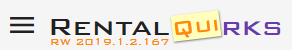

# RentalQuirks - Usability Enhancements for RentalWorks Web

RentalQuirks is a collection of JavaScript and CSS customizations for the ***RentalWorks Web** rental management software at `https://<your_company>.rentalworksweb.com` or `https://dbwcloud.com/<your_company>/rentalworks/` and developed by [Database Works](https://dbworks.com/). This is not for the legacy RentalWorks software, which runs as a Windows application; it is for their newer web-based service called RentalWorks Web. Since we don't have control over the code on the Database Works servers, all of these changes are "client-side", that is to say, rentalworksweb.com sends the official webpage to your web browser as usual, and then RentalQuirks modifies the webpage within your browser tab every time the page is loaded. If you choose to uninstall these scripts, RentalWorks will revert to exactly how it's always been. Check out the [Feature Overview](#Feature-Overview) for the current list of features.

# How to use

To use these scripts, you will need two generic browser extensions to automatically run the scripts whenever you visit `https://<your_company>.rentalworksweb.com` or `https://dbwcloud.com/<your_company>/rentalworks/`. One is responsible for UserScript (JavaScript) injection, and the other is responsible for UserStyle (CSS) injection. For Google Chrome, I recommend the [Tampermonkey] extension for the JavaScript and the [Stylus] extension for the CSS styling.

[][StylusChrome] 
[][StylusFirefox] 
[][StylusOpera]

[][TampermonkeyChrome] 
[][TampermonkeyFirefox] 
[][TampermonkeyOpera]

## Visual stying with CSS UserStyles
After installing the Stylus browser extension, click the two user.css links below and choose `Install Style` when prompted.

[rentalworks_styles.user.css](../../raw/master/css/rentalworks_styles.user.css) includes styles that directly improve the look and structure of RentalWorks Web, and is useful even without Tampermonkey and our custom JavaScript.
[rentalquirks_styles.user.css](../../raw/master/css/rentalquirks_styles.user.css) includes styles that are required by the Tampermonkey script. If `rentalquirks_styles.css` is installed, it is expected that `rentalworks_styles.css` is included as well.

## Functionality improvements with JavaScript UserScripts
After installing the Tampermonkey browser extension, go to the [RentalQuirks.user.js direct link](../../raw/master/RentalQuirks.user.js) and click the `Install` button.

## How to verify that the scripts are running

If the **CSS** is running, you will see a **QUI sticker** superimposed over the RentalWorks logo.  
If the **JavaScript** is running, you will see a **version number** superimposed over the RE logo. Note that this is the version number of the RentalWorks Web website, not of the RentalQuirks scripts.

You may also press `F12` to open the Chrome Developer Console to see if any exceptions in the scripts are being thrown. On a **full page refresh**, the last initialization script to run writes ***`--- RentalWorks - Quirks mode activated ---`*** to the console. If you do not see this, it may be that the scripts aren't running, or that an error interrupted the script before it could finish.

# Development Setup

If you'd like to edit these scripts, to fix problems or add new features, you'll want to temporarily disable the online scripts in Tampermonkey and Stylus, and create copies for yourself to edit.

CSS is very convenient to edit directly in the [Stylus] editor, as the target pages will update automatically with new styles as soon as you save them in the web browser.

To run and edit a local copy of the Tampermonkey scripts, see this StackOverflow post on [How to make a Tampermonkey script @require local files](https://stackoverflow.com/questions/49509874/how-to-update-tampermonkey-script-to-a-local-file-programmatically). With your system properly configured, you should be able to edit any Tampermonkey script (aside from the root one in the Tampermonkey web interface) in your editor of choice, save your changes, and refresh the webpage to have them applied.

You will have to make a copy of the root Tampermonkey script ([RentalQuirks.user.js](RentalQuirks.user.js)) in the Tampermonkey web interface, and change all of the @require tags to point at the files on your local machine. If you add a new .js file, make sure to add a new @require tag for it in both your private copy of the root script and the repository copy of the root script, [RentalQuirks.user.js](RentalQuirks.user.js).

For users to receive updates to the Tampermonkey script, the `@version` tag in the root script must be incremented.

# Feature Overview

Here is a short feature list of the **`rentalworks_styles.user.css`** script. This standalone set of styles improves the RentalWorks Web interface without the need for any JavaScript.

- In Settings, highlight headings and sections that are used quite often, so that they're easier to find.

Here is a short feature list of the **RentalQuirks** scripts. This includes both the CSS visual style script `rentalquirks_styles.user.css` as well as the JavaScript file `RentalQuirks.user.js`.

- Auto-login - If a password manager autofills your username and password, RentalQuirks will automatically click the Login button for you.
- Title Case formatting tool, globally available, usable on any form field.
- Copy and paste Inventory Item properties.
  - Currently rental items only
  - *Coming: same functionality for sales items*
- Copy and paste Kit items.
  - Use checkboxes to select subset of rows to copy.
  - *Coming: same functionality for "Completes"*
- Superior table filtering and sorting:
  - Left clicking a header toggles between sort up and sort down, and also removes sort on any existing columns.
  - Ctrl + Left click headers to maintain existing sort on other columns.
  - Right clicking a header brings up the menu, just like default RentalWorks left click behaviour.
  - Ctrl + Left click any table cell to filter the column by that value.

[Stylus]: https://add0n.com/stylus.html
[StylusChrome]: https://chrome.google.com/webstore/detail/stylus/clngdbkpkpeebahjckkjfobafhncgmne
[StylusFirefox]: https://addons.mozilla.org/en-US/firefox/addon/styl-us/
[StylusOpera]: https://addons.opera.com/en/extensions/details/stylus/

[Tampermonkey]: https://www.tampermonkey.net/
[TampermonkeyChrome]: https://chrome.google.com/webstore/detail/tampermonkey/dhdgffkkebhmkfjojejmpbldmpobfkfo
[TampermonkeyFirefox]: https://addons.mozilla.org/en-US/firefox/addon/tampermonkey/
[TampermonkeyOpera]: https://addons.opera.com/en/extensions/details/tampermonkey-beta/